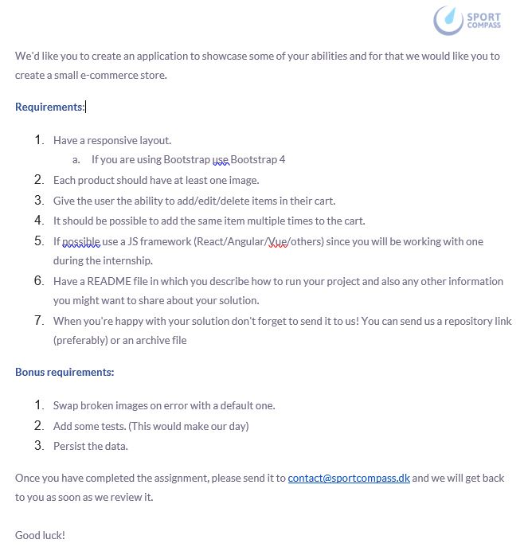

# EMART Website
[Link to the website](http://emartbymao.000webhostapp.com/">http://emartbymao.000webhostapp.com)

The website starts with a Login Page:  
|  Field   |    Input     |
| :------: | :----------: |
| Username |   testuser   |
| Password | testuserpass |

enter the details as given, hit login and voila! We are in our shopping mart.  
Now in EMART we can 'Add to Cart' all the items that we require. Adding the same item multiple times is not allowed.  
Now we can hit the down arrow to go to the bottom of our page and check the Cart. The Cart shows the item with the images, their price and also the quantity.  
Yes, Now this is where you can either increase the quantity of a certain item, decrease it or completely delete it from the Cart. The Total Cost will change accordingly.  
Theres now a button 'Print Invoice' which will let you print an invoice of all the cart items and the Total Payable Amount, this can then be saved as a PDF.  
Now we can finally hit the BUY button at the very bottom which will first return a message to the user "Thank you for your purchase! Clearing Cart...", it will then Clear Up the Cart  
The navbar has 2 more options apart from Shop, Logout and Contact.  
Logout will lead us to the login page again and Contact will take us to the About Us page which currently has a Lorem Ipsum  text on it.  
So thats it for how we operate the entire application. 

Requirements:  

1. Responsive Layout:
I used Bootstrap Grid to make a Responsive Layout.
2. Each Product has exactly 1 image.
3. The user has the ability increase,decrease the quantity and also to delete a particaular item.
4. To add the same item. I have added the feature to change the quantity in the Cart.
5. I used only plain VanilaJS to add the items in the cart-row and to calculate the total payable amount.
Bonus:
1. Swapping Broken Images: If you check the N-95 Mask image, I have given the incorrect address so as to replace that with an alternate image by triggering an onerror event.
2. I have added a Testing folder in this repository which i got by running the site through [WebPageTest](https://www.webpagetest.org/). Hope thats fine.
3. I wasnt sure about this one so what I have done is provided a PRINT INVOICE button to let the user save their cart items and get an invoice for the same.
Overall this assignment gave me an opportunity to learn a lot:
I created a login page which runs on PHP and MySQL.
Hosted the site with the backend on 000webhost.
Now that I found it difficult to save the cart items in MySQL. I had the idea to Print the same or to let the user save it locally as a PDF. I did the same through CSS.

Ashik is lazy.